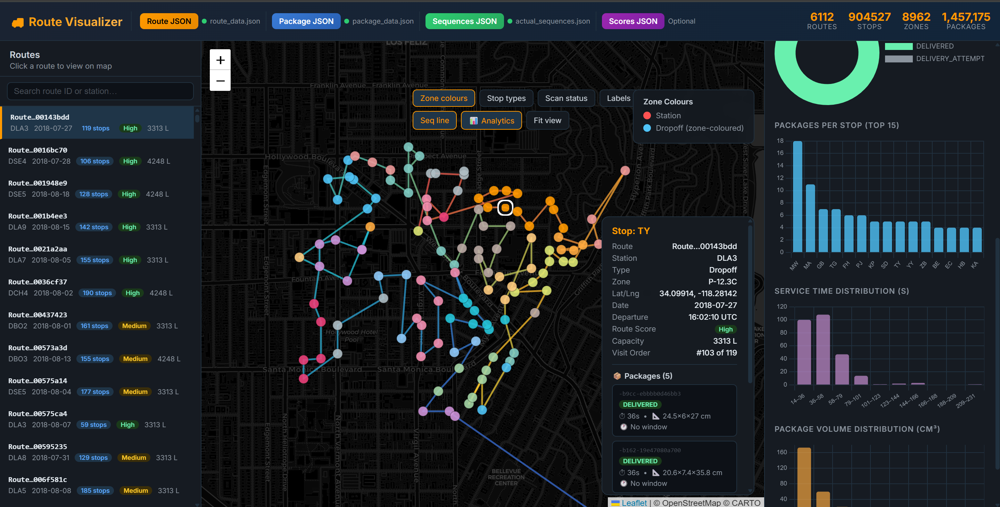

# LLMs as Graph Reasoners: Edge Criticality and Path Robustness in Last-Mile Routing



## Overview

This project computes **Eval-1 ground-truth edge importance** for Traveling Salesman Problem (TSP) instances derived from the Amazon Last Mile Routing dataset. It uses the LKH-3 solver to evaluate the criticality of each edge in routing networks.

**Edge Importance Formula:**
$$I_e = \frac{C(G \setminus e) - C(G)}{C(G)}$$

Where:
- $C(G)$ = optimal tour cost of the original graph
- $C(G \setminus e)$ = optimal tour cost after removing edge $e$
- $I_e$ = normalized importance of edge $e$

---

## Documentation

- **[Project Report](docs/report.pdf)** — Detailed technical report with methodology, evaluation metrics, and results
- **[Presentation](docs/PPT.pptx)** — Visual overview and key findings

---

## Directory Structure

```
TSP_Edge_importance_estimator/
├── config.py                    # Solver parameters, parallelism, paths
├── tsplib_io.py                 # TSPLIB file writer + LKH tour parser
├── lkh_runner.py                # LKH subprocess wrapper + solve_tsp()
├── eval1.py                     # Parallel Eval-1 computation
├── pipeline.py                  # Top-level orchestration (single + batch)
├── data_loader.py               # Route data loading utilities
├── dense_to_sparse.py           # Matrix conversion utilities
├── visualization.py             # Visualization helpers
├── requirements.txt
├── Readme.md                    # This file
├── docs/
│   ├── report.pdf              # Comprehensive technical report
│   └── PPT.pptx                # Project presentation
├── thumbnail/
│   └── thumbnail.png           # Project visualization thumbnail
└── tmp/                         # Auto-created; holds intermediate files
```

---

## Prerequisites

1. **Python 3.10+** (uses `str | None` union syntax)
2. **LKH-3 binary** — build from source:
   ```bash
   wget http://webhotel4.ruc.dk/~keld/research/LKH-3/LKH-3.0.9.tgz
   tar xvfz LKH-3.0.9.tgz
   cd LKH-3.0.9
   make
   sudo cp LKH /usr/local/bin/
   ```
   Alternatively, set `LKH_PATH` in `config.py` to point to your LKH binary.

3. **Dependencies:**
   ```bash
   pip install -r requirements.txt
   ```
   Note: Only numpy is required as an optional dependency. Core functionality uses Python standard library only.

---

## Installation

1. **Clone/download this project**
2. **Build LKH-3** (see Prerequisites)
3. **Configure LKH path** in `config.py`:
   ```python
   LKH_PATH = "/path/to/LKH"  # or export LKH_PATH environment variable
   ```
4. **Install Python dependencies:**
   ```bash
   pip install -r requirements.txt
   ```

---

## Usage

### Single Instance

```python
from pipeline import run_instance

result = run_instance(
    station_code="DAX_123",
    nodes=list(range(n)),
    distance_matrix=my_matrix,  # n×n list-of-lists, large finite for missing edges
)

# result["edge_importance"] → { "u,v": importance_float, … }
# Example output:
# {
#     "station_code": "DAX_123",
#     "base_cost": 1234.5,
#     "base_route": [0, 3, 7, 1, 5, ...],
#     "edge_importance": {
#         "0,3": 0.042,
#         "3,7": 0.015,
#         ...
#     }
# }
```

### Batch Processing

```python
from pipeline import run_batch

instances = [
    {"station_code": "S1", "nodes": [...], "distance_matrix": [...]},
    {"station_code": "S2", "nodes": [...], "distance_matrix": [...]},
]
results = run_batch(instances)
```

### Quick Test (Synthetic 10-node example)

```bash
python pipeline.py
```

---

## Design Decisions

| Decision | Rationale |
|---|---|
| `EDGE_WEIGHT_FORMAT = FULL_MATRIX` | Matrix is already sparse-encoded with large finite values; no edge list needed |
| `INITIAL_TOUR_FILE` on every perturbed run | Warm-start cuts convergence from hundreds to ~100 trials |
| `PENALTY = 7 × max(matrix)` | Dominant without causing 32-bit LKH overflow (capped at 2 × 10⁹) |
| `ProcessPoolExecutor` per edge | Embarrassingly parallel; one perturbed solve per worker |
| `NUM_WORKERS = cpu_count() - 1` | Leaves one core free to avoid OS thrashing |
| Row-slice copy for perturbation | Avoids full n² deep-copy; only two rows change per edge |
| Sequential instance processing | Keeps intra-instance parallelism clean; avoids CPU contention |

---

## Output Format

`run_instance()` returns a dictionary with:
- **station_code**: Identifier for the routing station
- **base_cost**: Optimal tour cost of the original graph
- **base_route**: Order of nodes in the optimal tour
- **edge_importance**: Dictionary mapping edge pairs to importance scores

Results are also written to `tmp/<station_code>/<station_code>_eval1.json`:
```json
{
  "station_code": "DAX_123",
  "base_cost": 1234.0,
  "base_route": [0, 3, 7, ...],
  "edge_importance": {
    "0,3": 0.042,
    "3,7": 0.015,
    ...
  }
}
```

---

## Configuration

Edit `config.py` to adjust:

```python
LKH_PATH = "LKH-3.0.9/LKH"         # Path to LKH binary
LKH_RUNS = 1                       # Number of independent runs per solve
LKH_MAX_TRIALS = 100               # Max trials per run (warm-start keeps this low)
PENALTY_MULTIPLIER = 7             # Penalty for removed edges (5-10x recommended)
NUM_WORKERS = cpu_count() - 1      # Parallel workers for edge evaluation
TMP_DIR = "tmp"                    # Working directory for intermediate files
```

---

## Performance Notes

- **Warmstarting**: Using the base tour significantly reduces solver iterations from ~100s to ~10s per edge
- **Parallelization**: Each edge removal is solved independently; scales with available CPU cores
- **Memory**: Stores only distance matrix + temporary LKH files; no full solution enumeration
- **Time**: Expect ~seconds per edge for small instances; hours for large networks (100+ nodes)

---

## Related Resources

- **LKH-3 Documentation**: [http://webhotel4.ruc.dk/~keld/research/LKH-3/](http://webhotel4.ruc.dk/~keld/research/LKH-3/)
- **TSPLIB Format**: Classic TSP benchmark format used for solver I/O
- **Amazon Last-Mile Routing Dataset**: Source data for evaluation instances

---

## License & Attribution

Cite this work as presented in the accompanying report. See `docs/report.pdf` for full methodology and experimental details.
```

Results are also written to `tmp/<station_code>/<station_code>_eval1.json`.
